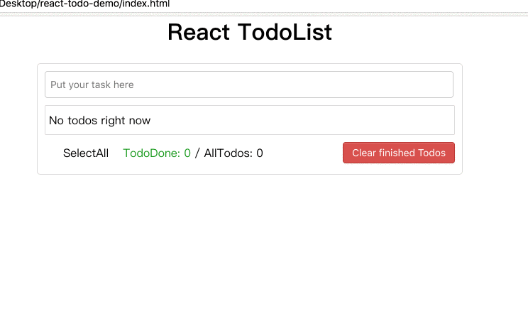
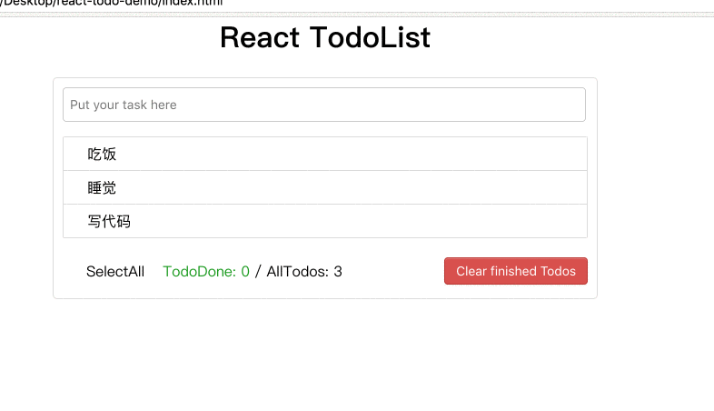
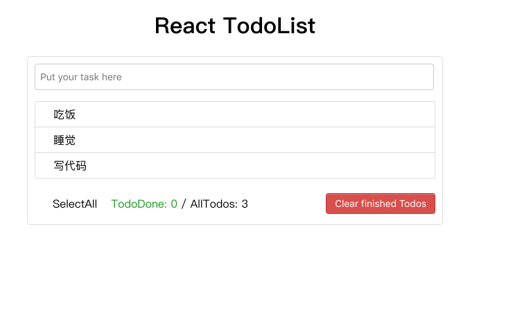
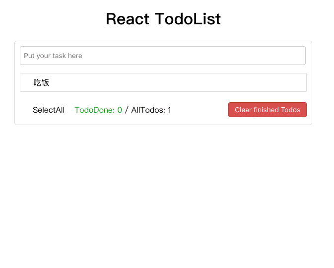

# 使用说明
* 使用前确保安装好相应环境

* cd React-todos

* yarn install

* 将localDb 放入 node_modules

* yarn run start

* 用浏览器打开index.html

## 项目地址
[React ToDoList](https://wangwenyue.github.io/React-todos/)

## 项目截图
* 增加todo

* 删除todo

* 标记todo

* 修改todo

## 项目功能
React-Todos是一个基于React框架的SPA管理任务清单，数据使用localStorage存储在浏览器中，使用webpack打包成静态页面。
### 具有以下几点功能：
- 在输入框输入任务名称，回车新增todo。
- 通过改变className，标记已完成的todo。
- 鼠标移入其中一个todo，可以删除。
- 运用setState的callback函数，对todo进行update。
- 能够全选所有todo，并能删除已完成的todo。
